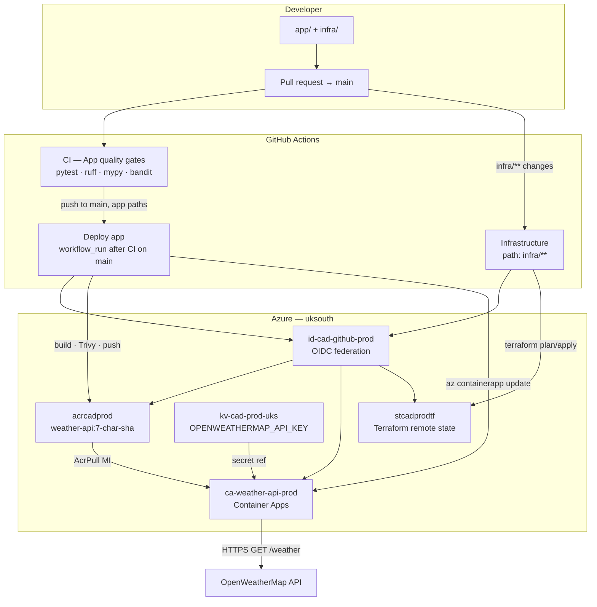

# Containerized API Deployment

Reference implementation of a **production-style supply chain** for a small tracer API: hardened container, Terraform on Azure (UK South), and GitHub Actions with OIDC. The weather service exists to exercise the pipeline—not as a product roadmap.

| | |
|---|---|
| **Repository** | [DNBLabs/containerized-api-deployment](https://github.com/DNBLabs/containerized-api-deployment) |
| **Live API (prod)** | `https://ca-weather-api-prod.redsky-b5616fdf.uksouth.azurecontainerapps.io` |
| **OpenAPI** | [/docs](https://ca-weather-api-prod.redsky-b5616fdf.uksouth.azurecontainerapps.io/docs) on the live host |

---

## Architecture



**v1 topology (three workflows):**

| Workflow | Trigger | Purpose |
|----------|---------|---------|
| [`ci.yml`](.github/workflows/ci.yml) | PR and push to `main` | App quality gates (`WEATHER_PROVIDER=mock`) |
| [`deploy-app.yml`](.github/workflows/deploy-app.yml) | `workflow_run` after successful CI on `main` | Build, Trivy (Critical), push ACR, update ACA, smoke `/health/live` |
| [`infra.yml`](.github/workflows/infra.yml) | PR/push to `main` when `infra/**` changes | `terraform fmt` / `validate` / `plan` (PR); `apply` on `main` only |

Branch protection on `main` requires the **App quality gates** check. Deploy and infra jobs use the GitHub **`production`** environment for Azure OIDC (no long-lived client secret in the repo).

Domain terms and CI contracts: [`CONTEXT.md`](CONTEXT.md).

---

## Quickstart (local, no Azure)

Primary path: **Docker Compose** with mock weather—no API keys.

**Prerequisites:** [Docker](https://docs.docker.com/get-docker/) with Compose v2.

```bash
git clone https://github.com/DNBLabs/containerized-api-deployment.git
cd containerized-api-deployment
docker compose up --build
```

In another terminal:

```bash
curl -s http://127.0.0.1:8000/health/live
curl -s "http://127.0.0.1:8000/weather?city=London"
open http://127.0.0.1:8000/docs   # optional: Swagger UI
```

Expected: `{"status":"ok"}` from live; JSON weather summary with `"provider":"mock"`.

**Optional — native Python** (faster iteration): see [`app/README.md`](app/README.md). Copy [`.env.example`](.env.example) to `.env` if using `uv run` outside Compose.

**Run tests locally** (same gates as CI):

```bash
cd app
uv sync --group dev
uv run pytest -q
uv run ruff check .
uv run mypy .
```

---

## Production operations

### Day-0 — Bootstrap remote state (once per subscription)

Bootstrap creates the Terraform state storage account. It uses **local state** in `infra/bootstrap/` (gitignored)—not CI. See [ADR 0001](docs/adr/0001-terraform-remote-state-bootstrap.md).

**Prerequisites:** [Terraform](https://developer.hashicorp.com/terraform/install) ≥ 1.5, `az login`, rights to create a resource group and storage account.

```bash
cd infra/bootstrap
terraform init
terraform plan
terraform apply
terraform output -json backend_config
```

If the default name `stcadprodtf` is globally taken, copy `terraform.tfvars.example` → `terraform.tfvars` and set a unique `storage_account_name`, then re-apply. Details: [`infra/bootstrap/README.md`](infra/bootstrap/README.md).

Grant your user **Storage Blob Data Contributor** on the storage account (and later grant the same to `id-cad-github-prod` for CI—see Day-1).

**Backup:** Keep a copy of `infra/bootstrap/terraform.tfstate` somewhere safe if you may need to destroy bootstrap resources later (ADR 0001).

### Day-1 — Main stack (production infra)

```bash
cd infra/envs/prod
cp backend.hcl.example backend.hcl   # fill from bootstrap backend_config
# PowerShell:
$env:ARM_USE_AZUREAD = "true"
# Bash:
# export ARM_USE_AZUREAD=true

terraform init -backend-config=backend.hcl -reconfigure
terraform plan
terraform apply
```

Operator guide and security notes: [`infra/envs/prod/README.md`](infra/envs/prod/README.md).

After apply, note outputs:

```bash
terraform output container_app_fqdn
terraform output github_ci_client_id
terraform output acr_login_server
```

### Key Vault secret (required for live weather)

The OpenWeatherMap key is **not** in Terraform or git. Set it once after infra exists:

```bash
az keyvault secret set \
  --vault-name kv-cad-prod-uks \
  --name openweathermap-api-key \
  --value "<your-openweathermap-api-key>"
```

Wait ~15s for RBAC propagation, then verify readiness:

```bash
FQDN=$(az containerapp show \
  --name ca-weather-api-prod \
  --resource-group rg-cad-prod-uksouth \
  --query properties.configuration.ingress.fqdn -o tsv)
curl -s "https://${FQDN}/health/ready"
curl -s "https://${FQDN}/weather?city=London"
```

### GitHub OIDC prerequisites

1. Create a GitHub Environment named **`production`** on this repository.
2. Restrict deployments to the **`main`** branch (recommended).
3. Add **environment secrets** (from `terraform output github_ci_client_id` and your Azure subscription):

   | Secret | Source |
   |--------|--------|
   | `AZURE_CLIENT_ID` | `github_ci_client_id` output |
   | `AZURE_TENANT_ID` | `az account show --query tenantId -o tsv` |
   | `AZURE_SUBSCRIPTION_ID` | `az account show --query id -o tsv` |

4. Ensure federated credentials on `id-cad-github-prod` trust this repo’s **`main`** ref and **`production`** environment (created by Terraform in `github_oidc.tf`).
5. Grant **`id-cad-github-prod`** **Storage Blob Data Contributor** on the bootstrap storage account (`stcadprodtf`) so the Infrastructure workflow can run `terraform init` against remote state.

No `AZURE_CREDENTIALS` JSON blob—workflows use [`azure/login@v2`](https://github.com/Azure/login) with OIDC.

### Rollback (manual, by image SHA)

Deployed images are immutable tags `acrcadprod.azurecr.io/weather-api:<7-char-git-sha>`. To roll back:

```bash
# List recent tags (newest first)
az acr repository show-tags --name acrcadprod --repository weather-api --orderby time_desc --top 10

# Point ACA at a previous SHA (example: 54a1fe9)
az containerapp update \
  --name ca-weather-api-prod \
  --resource-group rg-cad-prod-uksouth \
  --container-name weather-api \
  --image acrcadprod.azurecr.io/weather-api:54a1fe9
```

Confirm: `curl -fsS "https://${FQDN}/health/live"`. Automated rollback on failed deploy is **out of scope** for v1.

---

## Cost and teardown

### Estimated cost (personal demo)

Ballpark for **UK South**, always-on ACA with `minReplicas=1`, basic ACR, Key Vault, and storage: **~£15–40/month** depending on egress and registry usage. The stack is meant to stay up for portfolio review; tear down when you stop paying.

### Teardown order

1. **Destroy main stack** (releases app infra; state blob remains in storage):

   ```bash
   cd infra/envs/prod
   $env:ARM_USE_AZUREAD = "true"   # or export ARM_USE_AZUREAD=true
   terraform destroy
   ```

2. **Destroy bootstrap** (only after main stack; optional if you want to remove state storage):

   ```bash
   cd infra/bootstrap
   terraform destroy
   ```

If bootstrap local state was lost, you may need manual cleanup in the Azure portal—see ADR 0001 mitigations.

---

## Repository layout

| Path | Purpose |
|------|---------|
| [`app/`](app/) | FastAPI tracer API (`weather_api`), tests, Dockerfile |
| [`infra/bootstrap/`](infra/bootstrap/) | Day-0 state storage (local Terraform state) |
| [`infra/envs/prod/`](infra/envs/prod/) | Production Azure stack (remote state) |
| [`.github/workflows/`](.github/workflows/) | CI, deploy, infrastructure pipelines |
| [`compose.yml`](compose.yml) | Local Docker Compose |
| [`docs/`](docs/) | PRD, whitepaper, ADRs |

---

## Documentation

| Document | Description |
|----------|-------------|
| [`CONTEXT.md`](CONTEXT.md) | Domain glossary and v1 decisions |
| [`docs/PRD.md`](docs/PRD.md) | Product requirements |
| [`docs/adr/0001-terraform-remote-state-bootstrap.md`](docs/adr/0001-terraform-remote-state-bootstrap.md) | Bootstrap / remote state ADR |
| [`docs/Containerized_API_Deployment_Whitepaper.md`](docs/Containerized_API_Deployment_Whitepaper.md) | Design narrative |
| [`IMPLEMENTATION_PLAN.md`](IMPLEMENTATION_PLAN.md) | Task tracker and checkpoints |

---

## License

Portfolio / reference implementation—see repository owner for terms.
